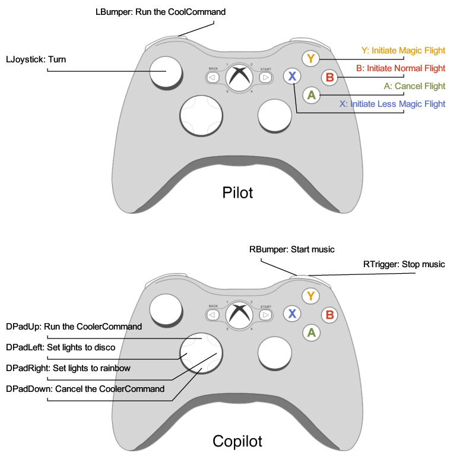

# COOP

Controller Operational Observation Program

---
COOP is a JavaScript program that lets you generate a button binding reference sheet for Xbox controllers.

## Usage

```
npx chickencoop -i /path/to/input -o /path/to/output

Options:
      --help     Show help                                             [boolean]
  -i, --input    The file to read from                       [string] [required]
  -o, --output   The file to write to                        [string] [required]
```

## Syntax

COOP will look for special lines in the input file. If your input file is a source code file, these lines can be added as comments.

```
coop:button(buttonName,text,controller)
```

### Button Name

This is the button's identifier, can be any of the following:

- `LJoystick`
- `RJoystick`

- `LBumper`
- `RBumper`

- `LTrigger`
- `RTrigger`

- `DPadUp`
- `DPadDown`
- `DPadLeft`
- `DPadRight`

- `A`
- `B`
- `X`
- `Y`

### Text

This will be the label text for the button. It can have spaces, but no commas or newlines

### Controller

Can be either `pilot` or `copilot`. `pilot` is the top controller in the diagram and `copilot` is the bottom one.

## Example

```txt
coop:button(LJoystick,Turn,pilot)
coop:button(LBumper,Run the CoolCommand,pilot)
coop:button(Y,Initiate Magic Flight,pilot)
coop:button(X,Initiate Less Magic Flight,pilot)
coop:button(B,Initiate Normal Flight,pilot)
coop:button(A,Cancel Flight,pilot)

coop:button(DPadUp,Run the CoolerCommand,copilot)
coop:button(DPadDown,Cancel the CoolerCommand,copilot)
coop:button(DPadLeft,Set lights to disco,copilot)
coop:button(DPadRight,Set lights to rainbow,copilot)

coop:button(RBumper,Start music,copilot)
coop:button(RTrigger,Stop music,copilot)
```


